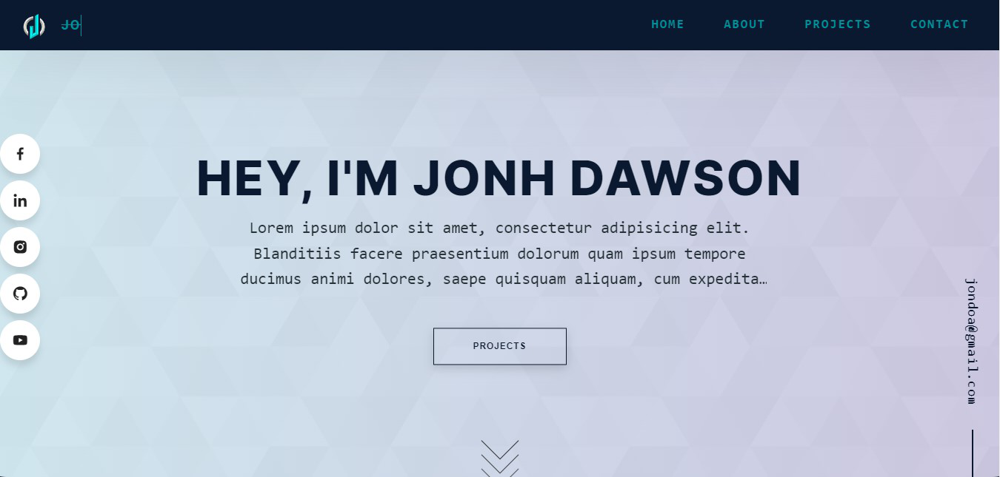

  

  
Check this on live

<h1 align="center">
     <a href="https://juyelhushen.netlify.app/">👉Joefolio</a>
     </h1>

  A simple Developer portfolio of built with <a href="https://angular.io/" target="_blank">Angular</a> and hosted with <a href="https://www.netlify.com/" target="_blank">Netlify</a>

## 🚨 Forking this repo (please read!)

Many people have contacted me asking me if they can use this code for their own website, and the answer to that question is usually **yes, with attribution**.

I value keeping my site open source, but as you all know, _**plagiarism is bad**_. It's always disheartening whenever I find that someone has copied my site without giving me credit. I spent a non-trivial amount of effort building and designing this portfolio website, and I am proud of it! All I ask of you all is to not claim this effort as your own.

### TL;DR

Yes, you can fork this repo.

## Technologies used 🛠️

- **HTML** 🚀
- **SCSS** 🚀
- **TypeScript** 🚀
- **Angular 15**
- **Angular Material**🚀
- **AOS**🚀
- **EmailJS**🚀

---

# Joefolio

This project was generated with [Angular CLI](https://github.com/angular/angular-cli) version 15.0.2.

## Development server

Run `ng serve` for a dev server. Navigate to `http://localhost:4200/`. The application will automatically reload if you change any of the source files.

## Code scaffolding

Run `ng generate component component-name` to generate a new component. You can also use `ng generate directive|pipe|service|class|guard|interface|enum|module`.

## Build

Run `ng build` to build the project. The build artifacts will be stored in the `dist/` directory.

## Running unit tests

Run `ng test` to execute the unit tests via [Karma](https://karma-runner.github.io).

## Running end-to-end tests

Run `ng e2e` to execute the end-to-end tests via a platform of your choice. To use this command, you need to first add a package that implements end-to-end testing capabilities.

## Further help

To get more help on the Angular CLI use `ng help` or go check out the [Angular CLI Overview and Command Reference](https://angular.io/cli) page.
